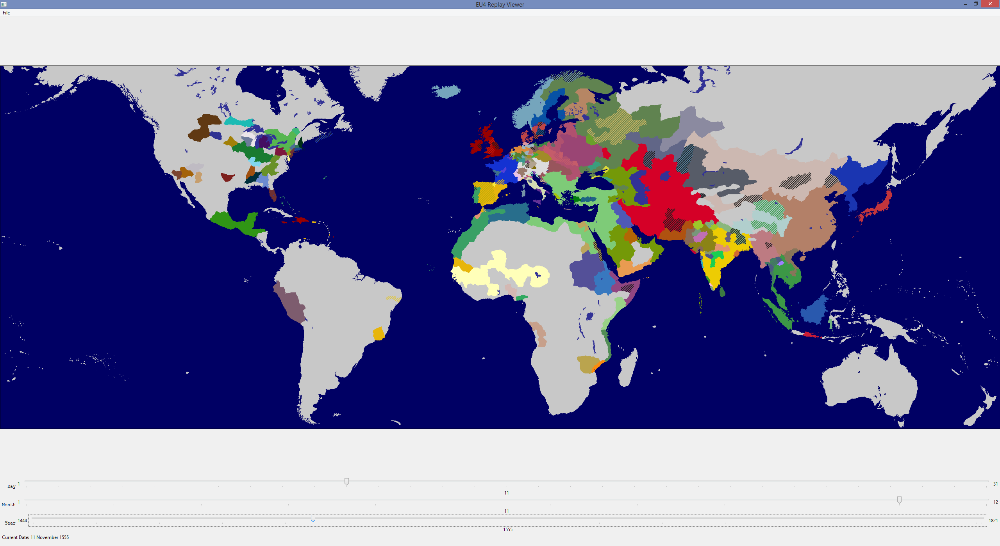

eu4Replay
=========

## Screenshots

### Windows

### Ubuntu

## Installation

### Windows

A pre-compiled package is available at http://goo.gl/uLUL2l

Extract this package to a folder and run `eu4Replay.exe` in order to launch the program.  If this does not work, please file an issue; it is currently only tested on amd64 Windows 8.1.

Alternatively, you can install the dependencies shown in the OS X & Linux section, either from source or from binary distributions.  I have tested with the amd64 binaries from http://www.lfd.uci.edu/~gohlke/pythonlibs/

### OS X & Linux

Install Python 2.7 and the following dependencies using your favourite package manager (eg, brew on OS X).  Versions which have been tested are shown in brackets.

Dependencies:
* wxpython (2.8.12.1)
* numpy (1.7.1)
* scipy (0.11.0)
* matplotlib (1.2.1)
* PIL (1.1.7)

After that, all that is required should be to clone this repo and configure your settings file.

## Configuration

### Overview

Configuration takes place in `settings.cfg`.

You must save any changes prior to launching the program.  Configuration changes are not currently supported via the GUI.

### EU4 Directory

You will need to specify the full path to your EU4 directory.

Please note that if you are entering a windows path, you *must* escape any backslashes.  In other words, enter `C:\\Games`, **not** `C:\Games`.

There is currently no intelligent mod support.  However, as long as your mod overrides the following files, you may be able to set `eu4_directory` to your mod directory:
* `map/provinces.bmp`
* `map/definition.csv`
* `map/default.map`
* `common/country_tags/`
* `common/countries/`
* `history/provinces/`

Proper mod support will be added in a later version.

### Start and End Dates

Enter `start_date` and `end_date` in `yyyy.mm.dd` format.

The program currently assumes that it will be able to determine the original owner of a province as at the start date (using the history files).

Unspecified behaviour may result if this is not possible.

### Month Names

You may localise month names using the `month_names` settings key.

Exactly 12 names are required, for obvious reasons.

## Animated GIFs

The `gif_settings` key contains several options which control how animated GIFs are generated:
* `tick_duration` is the time, in seconds, that a frame is displayed before the GIF changes
* `tick_years` is the time, in years, between frames

A GIF will be generated for all times between `start_date` and `end_date` (or as close as is possible given the value of `tick_years`.

## Usage

### Loading Province Data

The first thing you need to do is load the map data.  There are two ways to do this:

1. File -> Map -> Load Provinces File
  * this will load a previously-generated provinces file
2. File -> Map -> Build Provinces File
  * this will parse `provinces.bmp`, along with various other files, to determine the location of each province on the map
  * building a province file is a very slow process
  * you will be prompted for somewhere to save the file, so that you may re-use it in future
  * this should only be required if you are using a new map (eg, a mod)

A provinces file for the default map is available at http://goo.gl/XlwaMY

This file must be unzipped before use.

### Loading a Save File

Next, you need to load a save file, by choosing File -> Saves -> Load Save File.

Parsing the save file can take a few minutes.  Getting the province histories themselves is easy; the problem is dealing with tag changes, which requires parsing the entire file so that country histories can be accessed.

If this is an issue, I can look at further optimisation.

### Viewing History

Move the sliders to set the current date.

The map will update automatically, although it may take a few seconds if you're making big adjustments.  (This is because the history is advanced day-by-day.)

Previously viewed dates are cached to enable instant back-tracking.  If this causes memory issues, a configuration setting can be added to disable this behaviour.

## License

By downloading the software, you agree to abide by this license.

You are **not** free to redistribute this software, or reuse any part of this program, without the express written permission from the author.

All rights are reserved.

This license may be updated from time to time by publishing modifications to this file on github.  You will be bound by any such modifications once published.
